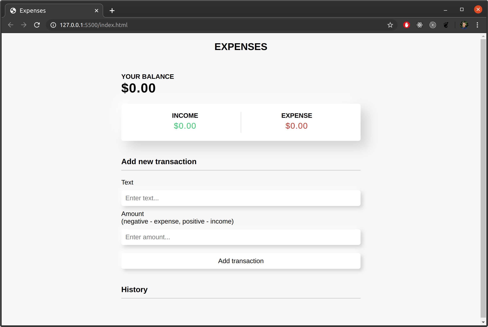

# expenses: A beautiful, simple budgeting app.
by mrivasperez - [live demo](https://mrivasperez.github.io/expenses/) - 

## About
Expenses is a budgeting app to help you write our your annual budget. I build it using HTML, CSS, and Vanilla JS (ES6). All information is store in loca storage.

### Use
Run index.html or try the [live demo](https://mrivasperez.github.io/expenses/)

### Author
[Miguel Rivas Perez](https://github.com/mrivasperez)

## Screenshot

